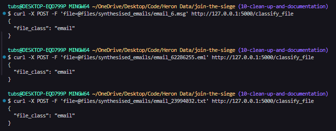
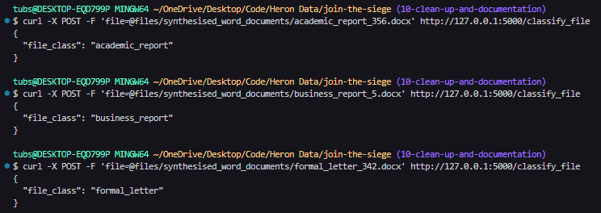

# Heron Coding Challenge - File Classifier

## Overview

At Heron, we’re using AI to automate document processing workflows in financial services and beyond. Each day, we handle over 100,000 documents that need to be quickly identified and categorised before we can kick off the automations.

This repository provides a basic endpoint for classifying files by their filenames. However, the current classifier has limitations when it comes to handling poorly named files, processing larger volumes, and adapting to new industries effectively.

**Your task**: improve this classifier by adding features and optimisations to handle (1) poorly named files, (2) scaling to new industries, and (3) processing larger volumes of documents.

This is a real-world challenge that allows you to demonstrate your approach to building innovative and scalable AI solutions. We’re excited to see what you come up with! Feel free to take it in any direction you like, but we suggest:


### Part 1: Enhancing the Classifier

- What are the limitations in the current classifier that's stopping it from scaling?
- How might you extend the classifier with additional technologies, capabilities, or features?


### Part 2: Productionising the Classifier

- How can you ensure the classifier is robust and reliable in a production environment?
- How can you deploy the classifier to make it accessible to other services and users?

We encourage you to be creative! Feel free to use any libraries, tools, services, models or frameworks of your choice

### Possible Ideas / Suggestions
- Train a classifier to categorize files based on the text content of a file
- Generate synthetic data to train the classifier on documents from different industries
- Detect file type and handle other file formats (e.g., Word, Excel)
- Set up a CI/CD pipeline for automatic testing and deployment
- Refactor the codebase to make it more maintainable and scalable


## Marking Criteria
- **Functionality**: Does the classifier work as expected?
- **Scalability**: Can the classifier scale to new industries and higher volumes?
- **Maintainability**: Is the codebase well-structured and easy to maintain?
- **Creativity**: Are there any innovative or creative solutions to the problem?
- **Testing**: Are there tests to validate the service's functionality?
- **Deployment**: Is the classifier ready for deployment in a production environment?


## Getting Started
1. Clone the repository:
    ```shell
    git clone <repository_url>
    cd heron_classifier
    ```

2. Install dependencies:
    ```shell
    python -m venv venv
    source venv/bin/activate
    pip install -r requirements.txt
    ```

3. Run the Flask app:
    ```shell
    python -m src.app
    ```

4. Test the classifier using a tool like curl:
    ```shell
    curl -X POST -F 'file=@path_to_pdf.pdf' http://127.0.0.1:5000/classify_file
    ```

5. Run tests:
   ```shell
    pytest
    ```

## Submission

Please aim to spend 3 hours on this challenge.

Once completed, submit your solution by sharing a link to your forked repository. Please also provide a brief write-up of your ideas, approach, and any instructions needed to run your solution.

# Challenge Answers

## Tasks & Approach

1. Poorly named files
2. Scaling to new industries
3. Processing larger volumes of documents

### 1. Poorly named files
The classifier has been modified to now follow a 4-phase approach, as follows:
1. Pass 1: The classifier first checks if the file's type can be identified by its extension. If the file has extensions of either '.eml' or '.msg', it can automatically be classified as an **email**.
2. Pass 2: If the extension cannot identify the type of the file, the classifier then checks if any of the valid identifying strings for a particular file type are present in the file name. The valid variations that can be used to identify file types are defined in [constants.py](src/constants.py)
3. Pass 3: If the extension and exact variation strings cannot be used to identify the file type, then the classifier checks if any of the variations are closely similar to the cleaned file name by checking if the Jaro-Winkler distance between any of the variations and the cleaned file name is above 0.85. If there is a high similarity between an identifying file type variation, then the file is classified as that file type.
4. Pass 4: If the file extension and file name approaches do not work, and if the file is of type `.txt` or `.docx`, then the classifier reads the contents of the file, and uses a trained Logistic Regression model to try and determine the type of the file.
    - Data used to train Logistic Regression model:
        - synthetically generated academic reports (`.docx`) - 227 files
        - synthetically generated business reports (`.docx`) - 225 files
        - synthetically generated formal letters (`.docx`) - 222 files
        - synthetically generated emails (`.txt`) - 223 files
    - Resulting model performance metrics:
        - Accuracy: `0.973`
        - Precision: `0.975`
        - Recall: `0.973`
        - f1 Score: `0.973`

The step here that focusses on poorly named files are passes 2 and 3. Both of these steps involve checking a cleaned version of the filename containing only its alphabetic characters, against the possible type identifiers. In part 3, similarity checking is performed which ensures that even if there are small differences in naming, it should be classified as the correct type of file.

### 2. Scaling to new industries
This was achieved by generating synthetic documents of the following types:
- Academic reports
- Business reports
- Emails
- Formal Letters

The synthetic files were created using `faker` data and different templates.

### 3. Processing larger volumes of documents
Due to time constraints, I was unable to modify the classifier to process multiple files at once. The set of documents available for testing is now larger, with
- 18 files generated as copies of the provided files but with poor naming
- approx. 250 synthesised email files
- approx. 250 synthesised academic report documents
- approx. 250 synthesised business report documents
- approx. 250 synthesised letter documents

## Output
#### A. Provided Samples

#### B. Provided Samples - with Name Variations to text if classifier can identify poorly named files
- Correctly Classified:


- Incorrectly Classified:
    - These were incorrectly classified as the character variations in the file names are really close to the start of the identifying string. Jaro-Winkler similarity considers character differences at the start of a string to be more signifcant, and hence lowers the similarity score for differences at the start.


#### C. Email Files
- Correctly Classified: As the word "email" is in the filename

- Correctly Classified: Even though the word "email" is not in the filename, correctly classified due to its extension


#### D. Word Document Files - Academic Reports, Business Reports, Formal Letters
- Correctly Classified: As the file type is in the filename


#### E. Classifying files based on contents when file type is not explicitly in the file name

The classification of these files is based on the file contents as the file type cannot be identified using just the file name. (This takes a couple more seconds to run than when the type is in the filename as the classifier first tries to classify files based on their names, and then if this fails loads in the trained ML model (logistic regression) and uses it for prediction.)


## Synthetised File Types
- The files synthesised to assist this solution are of the following types:
    - i. Emails (`.txt`)
        - Template: (all on same page)
            - From
            - To
            - CC
            - BCC
            - Date
            - Subject
            - Salutation
            - Email Contents
            - Sign-off
        - Example:
        ```
        From: James Logan <James Logan@mccoy.com>
        To: Ethan Small <Ethan Small@pearson.com>
        CC: None
        BCC: None
        Date: Sat, 17 Aug 2024 10:57:25
        Subject: Something fund party need behind science.

        Dear Ethan Small

        Region let catch plan. Check administration understand hour purpose million. Firm record class say interesting significant. Indicate politics both threat wind whether. Medical history any focus possible agency. Line my idea stock well fear.

        James Logan
        Textile designer
        James Logan@mccoy.com | 783-765-2798
        ```
    - ii. Academic Reports (`.docx`)
        - Template: (each on separate pages)
            - Title Page: (topic title and authors)
            - Abstract
            - Table of Contents
            - Topic 1
            - Topic 2
            - ...
            - Topic n
            - Bibliography
    - iii. Business Reports (`.docx`)
        - Template: (each on separate pages)
                - Title Page: ("Annual/Monthly Report: Report Period")
                - Executive Summary
                - Table of Contents
                - Introduction
                - Topic 1
                - Topic 2
                - ...
                - Topic n
                - References
    - iv. Formal Letters (`.docx`)
        - Template: (all on one page)
            - Sender Name & Address
            - Letter Date
            - Receiver Name & Address
            - Salution
            - Subject
            - Letter Contents
            - Sign-off
